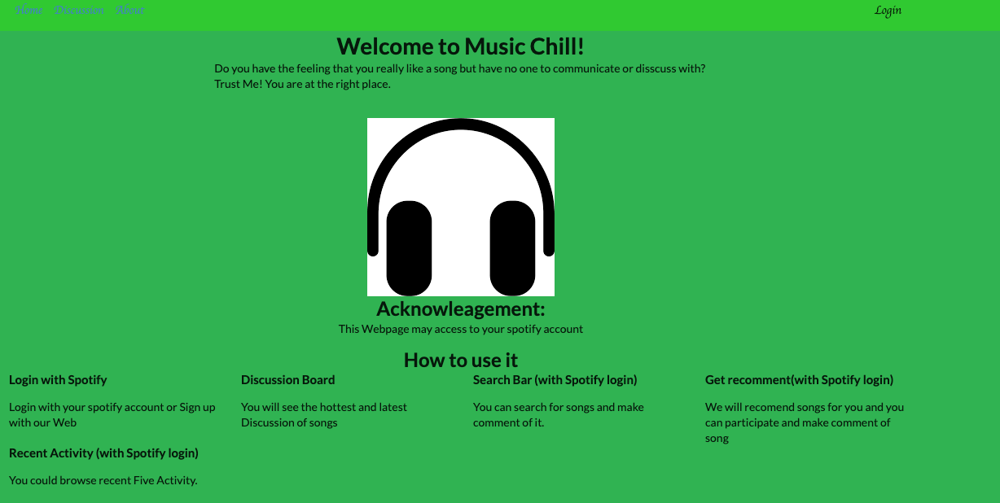

# Music-Chill

Music Web application for Users to discuss, comment with other Users about songs.

## Objective

Provides a platform to music lovers.

Try to find common music interest between Users and let users communicate with each other.

## Preview


## Screenshots




## Tech

-   Meteor
-   React
-   Heroku
-   Spotify API

## Font 

-   Amatic SC
-   Josefin Sans

## Color 

-   #5DBF24	
-   #2AC926  
-   #2BB34F 
-   #26C980 
-   #24BFA5

## Installation

```sh
$ git clone 
$ meteor
```

## Links

-   [Link](https://final-project-music-chill.herokuapp.com)
-   [Video](https://youtu.be/8BdJyNh_tPs)
-   [Class](http://johnguerra.co/classes/webDevelopment_spring_2019)


## Authors

-   Zhou Shang (https://my-web-page-project.herokuapp.com/index.html)


## License

This project is licensed under the MIT License - please see the [LICENSE](LICENSE)
